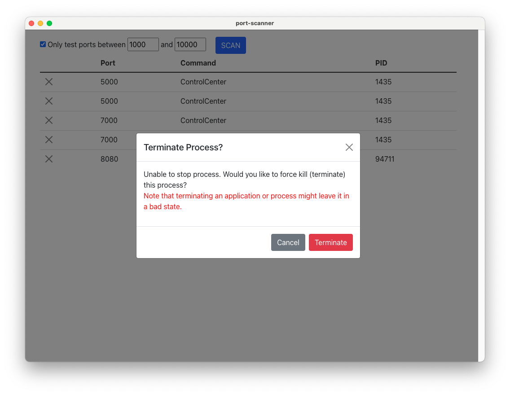

## Overview

This app scans for processes based on the network ports currently in use. The primary use case for me is to be able to easily scan for and terminate stray processes using development ports I need.

For instance, port 8080 is a port commonly used for development. So if it's in use, I can easily scan for that port with this app and terminate whatever process is using that port.

Built on using [Svelte Electron Boilerplate](https://github.com/ptkdev-boilerplate/svelte-electron-boilerplate).

### App Screenshot



## Running the App
There are pre-built binaries in the [builds](./builds) folder. Otherwise, run the `build` script for your platform.

### Build Scripts
- MacOS 	- `npm run build-mac`
- Windows 	- `npm run build-win`
- Linux 	- `npm run build-lnx`

## WSL Support
The Windows version can also scan for WSL processes. However, this functionality depends on `lsof`.
If it doesn't come pre-installed with your Linux distro, you can install it with the following command: `sudo apt-get install lsof`.

If you don't install `lsof`, you'll get the following error:
<span style="color:red; font-weight:bold">Error getting processes Error: Command failed: wsl lsof -nP -iTCP -sTCP:LISTEN</span>

Optionally, you can just disable checking for WSL processes on the app.

## Development

### Installing dependencies

```sh
npm i
```

### Dev Environment

Start the app in the `dev` environment. This starts the renderer process in [**hot-module-replacement**](https://webpack.js.org/guides/hmr-react/) mode and starts a webpack dev server that sends hot updates to the renderer process:

```sh
npm dev # Starts web app
npm dev:electron # Starts Electron process
```

## Known Issues
- App shows an error alert when after trying to terminate a WSL process even after successfully terminating the process.
  If you click the SCAN button and the process disappears from the list, then it was terminated.